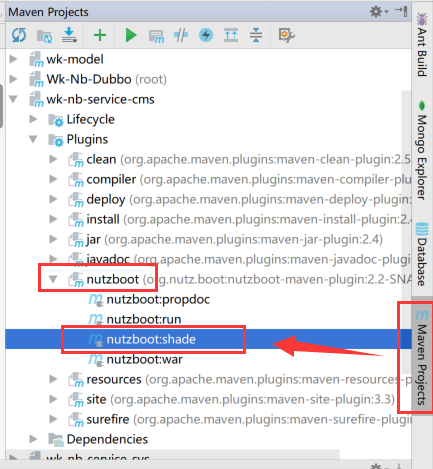

## 项目部署

* 确保在根目录已执行 `mvn clean install -Dmaven.test.skip=true`

* IDEA右侧展开 Maven Projects，先编译，后打包 点击root目录下的lifecycle中的编译和打包



* 当然也可以在命令行进行打包

  D:\NutzWk5\wk-app\wk-nb-service-sys>mvn clean package nutzboot:shade
  
*   在项目根目录执行
  `mvn -Dnutzboot.dst=E:/dst clean package nutzboot:shade`
   //会在E:/dst目录生成多个子模块的可运行jar

* 以 wk-nb-service-sys-5.0.1-SNAPSHOT.jar 为例，重命名为 sys.jar

  执行  `java -jar  -Xmx512m -Xms512m -Dnutz.profiles.active=prod -jar sys.jar &`

* 也可以编写脚本，以下是某个项目的脚本示例 start_water_jars.sh

* 详见：[https://github.com/nutzam/nutzboot-maven-plugin](https://github.com/nutzam/nutzboot-maven-plugin)

```text
#!/bin/bash
# 端口号  
#PORTS=()
# 系统模块
MODULES=(water_sys water_serviceApi water_dev water_water water_task water_consumer water_web water_web_api)
# 系统模块名称
MODULE_NAMES=(sys模块 api模块 dev模块 water模块 task模块 consumer模块 web模块 web_api模块)
# jar包数组  
JARS=(wk-nb-service-sys-5.0.1-WR-SNAPSHOT.jar wk-nb-service-api-5.0.1-WR-SNAPSHOT.jar wk-nb-service-dev-5.0.1-WR-SNAPSHOT.jar wk-nb-service-water-5.0.1-WR-SNAPSHOT.jar wk-nb-task-5.0.1-WR-SNAPSHOT.jar wk-nb-consumer-5.0.1-WR-SNAPSHOT.jar wk-nb-web-platform-5.0.1-WR-SNAPSHOT.jar wk-nb-web-api-5.0.1-WR-SNAPSHOT.jar)
# jar包路径
JAR_PATH='/data/water/jars'
# 日志路径  
LOG_PATH='/data/water/logs'
start() {  
  local MODULE=  
  local MODULE_NAME=  
  local JAR_NAME=  
  local command="$1"  
  local commandOk=0  
  local count=0  
  local okCount=0  
 # local port=0
  for ((i=0;i<${#MODULES[@]};i++))
  do
    MODULE=${MODULES[$i]}  
    MODULE_NAME=${MODULE_NAMES[$i]}  
    JAR_NAME=${JARS[$i]}  
  #  PORT=${PORTS[$i]}  
    if [ "$command" == "all" ] || [ "$command" == "$MODULE" ];then  
      commandOk=1  
      count=0  
      PID=`ps -ef |grep $(echo $JAR_NAME | awk -F/ '{print $NF}') | grep -v grep | awk '{print $2}'`  
      if [ -n "$PID" ];then  
        echo "$MODULE---$MODULE_NAME:已经运行,PID=$PID"  
      else  
        exec nohup java -Dnutz.profiles.active=test  -jar $JAR_PATH/$JAR_NAME >> $LOG_PATH/$JAR_NAME.out & 
        sleep 5s 
   #     PID=`netstat -apn | grep $PORT | awk '{print $7}' | cut -d/ -f 1`  
	PID=`ps -ef |grep $(echo $JAR_NAME | awk -F/ '{print $NF}') | grep -v grep | awk '{print $2}'`    
    while [ -z "$PID" ]  
        do  
          if (($count == 5));then  
            echo "$MODULE---$MODULE_NAME:$(expr $count \* 10)秒内未启动,请检查!"  
            break  
          fi  
          count=$(($count+1))  
          echo "$MODULE_NAME启动中.................."  
          sleep 5s  
        #  PID=`netstat -apn | grep $PORT | awk '{print $7}' | cut -d/ -f 1`  
        PID=`ps -ef |grep $(echo $JAR_NAME | awk -F/ '{print $NF}') | grep -v grep | awk '{print $2}'`
	 done  
        okCount=$(($okCount+1))  
        echo "$MODULE---$MODULE_NAME:已经启动成功,PID=$PID"  
      fi  
    fi  
  done  
  if(($commandOk == 0));then  
    echo "第二个参数请输入:mcht|system|user|act"  
  else  
    echo "............本次共启动:$okCount个服务..........."  
  fi  
}  
  
stop() {  
  local MODULE=  
  local MODULE_NAME=  
  local JAR_NAME=  
  local command="$1"  
  local commandOk=0  
  local okCount=0  
  for((i=0;i<${#MODULES[@]};i++))  
  do  
    MODULE=${MODULES[$i]}  
    MODULE_NAME=${MODULE_NAMES[$i]}  
    JAR_NAME=${JARS[$i]}  
    if [ "$command" = "all" ] || [ "$command" = "$MODULE" ];then  
      commandOk=1  
      PID=`ps -ef |grep $(echo $JAR_NAME | awk -F/ '{print $NF}') | grep -v grep | awk '{print $2}'`  
      if [ -n "$PID" ];then  
        echo "$MODULE---$MODULE_NAME:准备结束,PID=$PID"  
        kill -9 $PID  
        PID=`ps -ef |grep $(echo $JAR_NAME | awk -F/ '{print $NF}') | grep -v grep | awk '{print $2}'`  
        while [ -n "$PID" ]  
        do  
          sleep 3s  
          PID=`ps -ef |grep $(echo $JAR_NAME | awk -F/ '{print $NF}') | grep -v grep | awk '{print $2}'`  
        done  
        echo "$MODULE---$MODULE_NAME:成功结束"  
        okCount=$(($okCount+1))  
      else  
        echo "$MODULE---$MODULE_NAME:未运行"  
      fi  
    fi  
  done  
  if (($commandOk == 0));then  
    echo "第二个参数请输入:mcht|system|user|act"  
  else  
    echo "............本次共停止:$okCount个服务............"  
  fi  
}  
  
  
case "$1" in  
  start)  
    start "$2"  
  ;;  
  stop)  
    stop "$2"  
  ;;  
  restart)  
    stop "$2"  
[java] view plain copy
  sleep 3s  
  start "$2"  
;;  
*)  
  echo "第一个参数请输入:start|stop|restart"  
  exit 1  
;;
esac

```